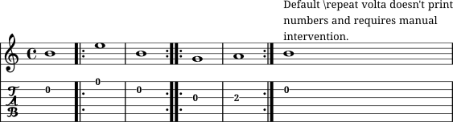
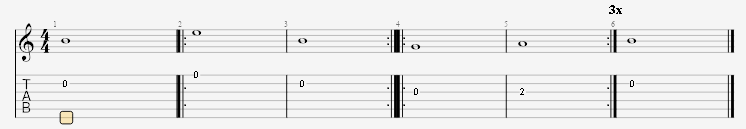
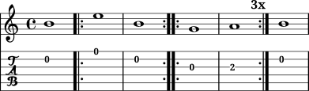

# RitornelloWithNumbersExplicit
Lilypond snippet that makes similar ritornello to that of GuitarPro's notation.

## TL;DR

This an extended and glorified `\repeat volta` with automated `markup` and `\textEndMark`.

If using in folded scores, remove the tag unScore from the musical expression inside the score block. If using on unfolded scores (through `\unfoldRepeats`), remove the tag folScore from the musical expression inside the score block.

# Usage
To use this snippet you invoke it like a `\repeat volta`, i.e `\ritornello 3 {c1 d1 c1}`. It takes two arguments: a number (total number of repetitions/voltas) and a musical expression; in the musical expression you can add an `\alternative` or any other \volta commands. The main command inside this snippet is `\repeat volta`. I've just add some logic, formatted text and some tags.

The command uses the follow structure: `\ritornello number {musical_expression}`. Arg1 is a number? predicate and arg2 is a ly:music? predicate. Arg1 must be equal or higher than 1; 0 will break the snippet, causing a compile error.

## Examples

The following code generates a guitar score with standard staff and tablature.

```
\version "2.24.0"
\include "ritornello.ly"
guitarOneNotes = {{b1 \ritornello 2 { e'1 b } \ritornello 3 { g1 a } b1 }}
guitarOne = {
<<
  \new Staff \removeWithTag #'() {\transpose c c' {{\guitarOneNotes}}}
  \new TabStaff \removeWithTag #'(section sectionInd) {\guitarOneNotes}
>>} % end guitarOne
\score { \removeWithTag #'unScore {\guitarOne} }
\score { {\unfoldRepeats {\removeWithTag #'(folScore section) {\guitarOne}}}}
```

## In-depth usage

There are three main functions on this snippet: `\ritornelloCore` is the engine, which will create the total number of returns on a folded score and, when unfolded through `\unfoldRepeats`, it will print the start of each new return ("2ºv.:", "3ºv.:", "4ºv.:" and so on...) - do not call it; `\ritornello` is the command and headstar of the snippet - it is a wrapper function of `\ritornelloCore`; ritornelloPivot add a "Pivot" markup to the next measure after the end of the repeat musical expression, so as to warn the reader that the repetition is over and the next measures ahead are pivots.

There are also three main tags: `folScore` is a tag that is meant to be used in folded scores and is used for print the total number of returns; `unScore` is a tag that is meant to be used in unfolded scores and is used to print the "start of theme" mark and the pivot mark; sectionInd is meant to be used in unfolded scores and is used to create the volta indication markups. The main reason that sectionInd is not engulfed by the unScore tag is because of multi-staff instrument (like guitars, which use standard staff notation and tablature); not using sectionInd duplicates every mark.

So each score block must have it's musical expression remove the opposing tag: folded scores must remove the `unScore` tag and unfolded scores must remove `folScore`. And each multi-staff instrument that uses the same variable must have only one staff without the removal of the `sectionInd` tag.

For beginner users: download the main snippet file and put it somewhere safe. On project file you have to include it (`\include /path/to/snippet/ritornello.ly`) in the beginning of the file, after the `\version` statement.

The main reason this snippet exist is to quicken writing time and reduce engraving error committed by the user.
 
The second reason I wrote this snippet is to facilitate migration of GuitarPro users to Lilypond, featuring a ritornello function that creates a similar visual style.

# Images to ilustrate a point
The default Lilypond ritornello command does not print the total number of voltas, thus requiring manual intervention of the user.   


Comparing it to GuitarPro's ritornello command, beginner users might get confused as to why their ritornellos don't print the total number of repeats. After learning that this is not a bug - but a feature - the migrating user may abandon the process and return to GuitarPro (or similar notation software).


This snippet counts the total amount of repeats and prints it as a `\textEndMark` (TODO #1). I don't think this should be the default/standard Lilypond command, but should at least be brought up to beginner users.



# TODO:
- Change `\textEndMark` to a command that is "staff isolated".
  
`\textEndMark` is a top-of-score command, which print at the last moment before new music expressions but is restricted to the staff, not going up to the highest staff.

- Redirect point-and-click to the music expression line instead of the snippet file.
  
When using Frescobaldi's (and other IDE's) point-and-click functionality on `\textMark` and `\textEndMark`, the redirect goes to the snippet file. Normal behaviour should be the point-and-click redirecting to the music expression line (where the command is being called). I am not knowledged enough on any programming matter to speculate a solution; only time, with a substantial amount of help, will tell.   

# A little (lot) of personal explanations

This snippets was created to mimic GuitarPro's ritornello appearance (i.e, displaying the total number of returns). Lilypond's documentation explicitly states that returns must be indicated at the start of the repeated musical expression - counter to what GuitarPro does.

One thing that always annoyed me while writing the repetition through `\repeat volta` was that I had to manually change the printed number (be it `markup` or `\textEndMark`). My scores were prone to mistakes due to the double work of writing repetitions and text separately. 

I'm pretty sure advanced users already knew of this hassle and how to circunvent it. However, the current stable documentation does not mention this problem and, as it doesn't comment such issue, doesn't provide any answers to beginning users.

A snippet that automatically prints the total number was always on my mind, but I didn't have the knowledge to implement it. Still today I don't have the minimum know-how, but with help from AI (ChatGPT) and the Lilypond user community, I was able to mangle together this snippet.

Don't get me wrong, I wrote less than 5% of the Scheme code. Scheme, to me, is very cryptic and strange. I'm not a programmer and don't claim to be. However, I do know a bit of programming principles to extract functional and *safe-ish* code from an AI. And, of course, the user community is an amazing space, which provided substantial suggestions to the code. 

The main problem of this snippet is that the total number of repetition is written through a `\textEndMark`. As the `\textEndMark` always prints in the highest staff, confusing may arise while printing multiple staffs together with different repetition end points.
